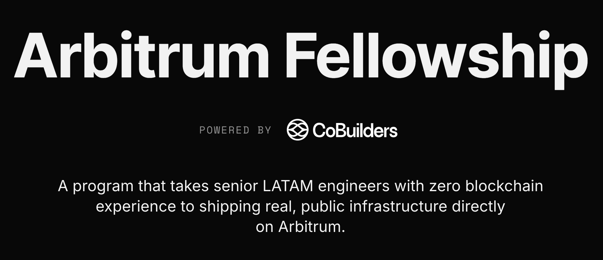

<p align="center">
  
</p>

# Arbitrum Stylus Fellowship

[](LICENSE)

This is the official monorepo template for the **Arbitrum Stylus Fellowship** run by [CoBuilders](https://cobuilders.xyz). Fellows fork this repo to complete hands-on exercises and share independent projects throughout the program.

## Relevant Links

| Resource              | Link                                                                                    |
| --------------------- | --------------------------------------------------------------------------------------- |
| Fellowship Curriculum | [cobuilders.notion.site](https://cobuilders.notion.site/arbitrum-fellowship-curriculum) |
| Arbitrum Docs         | [docs.arbitrum.io](https://docs.arbitrum.io)                                            |
| Stylus Quickstart     | [docs.arbitrum.io/stylus/quickstart](https://docs.arbitrum.io/stylus/quickstart)        |
| Stylus by Example     | [stylus-by-example.org](https://stylus-by-example.org)                                  |
| Stylus SDK (Rust)     | [github.com/OffchainLabs/stylus-sdk-rs](https://github.com/OffchainLabs/stylus-sdk-rs)  |
| Hardhat Docs          | [hardhat.org/docs](https://hardhat.org/docs)                                            |
| Foundry Book          | [book.getfoundry.sh](https://book.getfoundry.sh)                                        |
| CoBuilders            | [cobuilders.xyz](https://cobuilders.xyz)                                                |

## Prerequisites

Install everything below **before Week 1**. The fellowship moves fast and you don't want to debug toolchain issues during a hands-on session.

### Required from Day 1

| Tool                  | Min version       | What it's for                            |
| --------------------- | ----------------- | ---------------------------------------- |
| **Git**               | 2.x               | Version control, forking this repo       |
| **Node.js**           | 20 LTS            | Hardhat, frontend tooling, scripts       |
| **pnpm** _or_ **npm** | pnpm 9+ / npm 10+ | Package management                       |
| **Foundry**           | latest            | Forge, Cast, Anvil, Chisel               |
| **Rust**              | 1.81+ (stable)    | Stylus contracts from Week 3 on          |
| **Docker**            | 24+               | Nitro devnode for local Arbitrum testing |
| **Code editor**       | —                 | We recommend **Cursor** or VS Code       |

### Rust & Stylus Targets (needed from Week 3)

After installing Rust, add the WASM compilation target and the `cargo-stylus` CLI:

```bash
rustup target add wasm32-unknown-unknown
cargo install cargo-stylus
```

Verify with:

```bash
rustup show            # should list stable toolchain + wasm32-unknown-unknown
cargo stylus --version
```

### Wallet & Testnet ETH

| What                                  | Details                                                            |
| ------------------------------------- | ------------------------------------------------------------------ |
| **MetaMask** (or any injected wallet) | [metamask.io](https://metamask.io) — install the browser extension |
| **Arbitrum Sepolia testnet ETH**      | Ask the team!                                                      |

### Recommended Editor Extensions

- **Solidity** — [Nomic Foundation Solidity](https://marketplace.visualstudio.com/items?itemName=NomicFoundation.hardhat-solidity) (Hardhat) or [Juan Blanco Solidity](https://marketplace.visualstudio.com/items?itemName=JuanBlanco.solidity)
- **rust-analyzer** — [rust-lang.rust-analyzer](https://marketplace.visualstudio.com/items?itemName=rust-lang.rust-analyzer)
- **Even Better TOML** — for `Cargo.toml` and `foundry.toml`

### Sanity Check

Run these commands to verify your setup is complete:

```bash
git --version           # >= 2.x
node -v                 # >= 20
forge --version         # Foundry
rustup show             # stable + wasm32-unknown-unknown
cargo stylus --version  # cargo-stylus CLI
docker --version        # >= 24
```

> **Tip:** You can skip the Rust/Stylus setup until Week 3 if you prefer, but we recommend getting it out of the way early.

## Repo Structure

```
├── hands-on/          # Exercise briefs written by mentors (read-only for fellows)
│   └── 00-simple-storage.md
├── projects/          # Your work goes here, one folder per exercise or project
│   └── 00-simple-storage/
└── README.md
```

## How It Works (Monorepo Guide)

Each exercise or project lives under `projects/` as a **self-contained directory**. There is no shared workspace tooling, every project manages its own dependencies, build config, and README independently.

### Creating a New Project

1. Create a new folder under `projects/` following the naming convention `NN-project-name`:

   ```bash
   mkdir projects/00-simple-storage
   ```

2. Initialize your project inside that folder (Hardhat, Foundry, Cargo, or any relevant toolchain).

3. Add a `README.md` to your project folder explaining:
   - What the project does
   - Prerequisites and setup instructions
   - How to compile, test, and deploy
   - Any design decisions or notes

4. Commit and push to your fork.

> See [`projects/00-simple-storage`](projects/00-simple-storage/) for a complete reference of what we expect.

### Naming Convention

| Pattern   | Example             | Use case                                           |
| --------- | ------------------- | -------------------------------------------------- |
| `NN-name` | `00-simple-storage` | Matches a hands-on exercise                        |
| `name`    | `my-amm`            | Free-form project, snippet, etc. you want reviewed |

The numeric prefix keeps things ordered. Use the same number as the matching `hands-on/` brief when completing an exercise.

## Hands-On Exercises

The `hands-on/` folder contains exercise briefs in the format `NN-description.md`. These are written by mentors and describe what to build, the expected deliverables, and links to relevant resources.

Browse the current exercises in [`hands-on/`](hands-on/).

## License

This project is licensed under the [MIT License](LICENSE).
